# golem

A set of experiments on running LLMs locally, mostly GLM 4.6 for now, therefore, GoLeM.

This is a small experiment on dynamic expert reallocation for MoE models. Motivation for this experiment comes from [reddit discussion](https://www.reddit.com/r/LocalLLaMA/comments/1obrde8/comment/nkjqt91/) of [Cerebras REAP](https://www.cerebras.ai/blog/reap), with the idea of storing a subset of experts on slower storage.

### Setup

* Hardware:
  * Apple Mac Studio M2 Ultra;
  * 72 GPU Cores;
  * 192GB unified memory;
  * SSD is used as a secondary memory.
* Models:
  * [GLM-4.6-4bit](https://huggingface.co/mlx-community/GLM-4.6-4bit) - 160 routed experts per layer, 8 selected;
  * [Qwen3-235B-A22B-6bit](https://huggingface.co/mlx-community/Qwen3-235B-A22B-Instruct-2507-6bit) - 128 routed experts per layer, 8 selected;
  * [MiniMax-M2-6bit](https://huggingface.co/mlx-community/MiniMax-M2-6bit) - 256 routed experts per layer, 8 selected;

### High-level approach

* Focus on generation, and ignore prefill for now - just load all experts layer by layer during prefill;
* Load model without expert weights;
* Patch model's MoE modules with cached wrapper, which loads missing experts on demand; Use mlx generation functionality;
* During generation, if expert is missing from the fast storage (cache), evict one of unused experts (currently LRU) and load the needed one.

### Experiment results

Charts below can be reproduced with:
```
% CACHE_SIZES=64,80 ./report/gen_report.sh path/to/llms/Qwen3-235B-A22B-Instruct-2507-6bit
% CACHE_SIZES=96,128 ./report/gen_report.sh path/to/llms/GLM-4.6-4bit
% CACHE_SIZES=192,224 ./report/gen_report.sh ~/projects/llms/minimax-m2-6bit
```

#### Cold start: hitrate by token

Qwen3-235B-A22B-6bit:
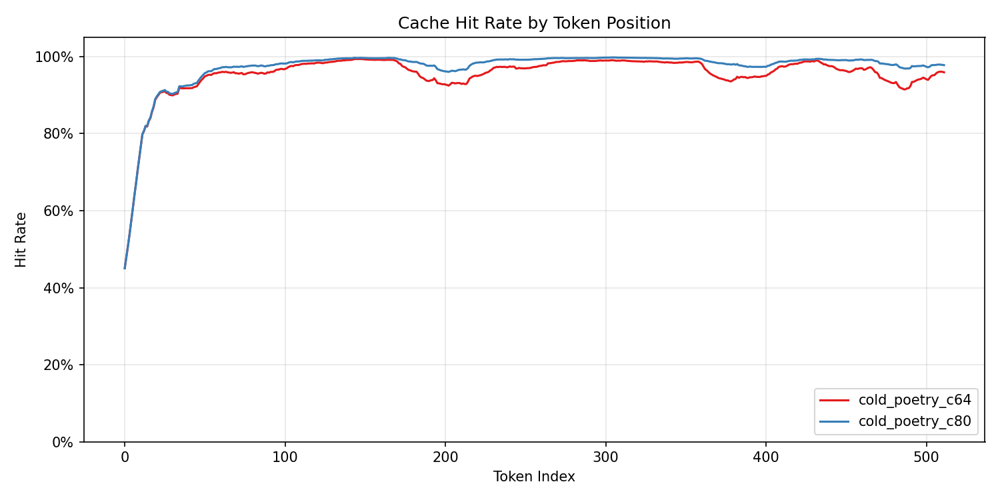

GLM-4.6-4bit:
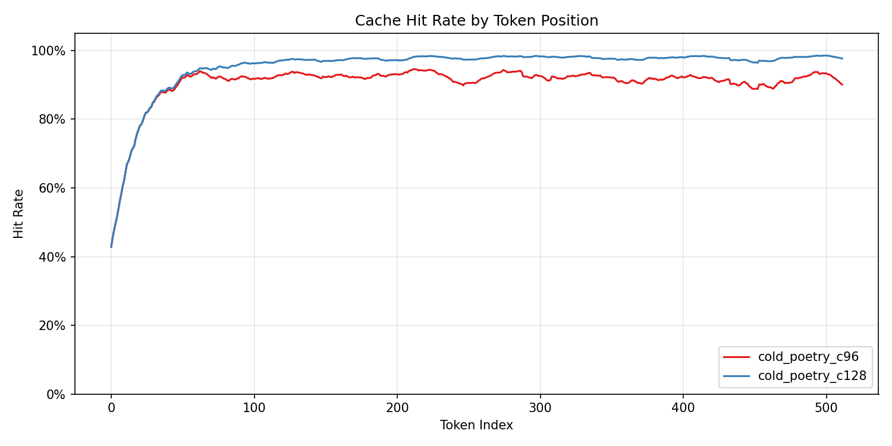

We can observe the quick warmup section as we get relevant experts. After that hit rate stays stable.

#### Cold start: hitrate by layer

Qwen3-235B-A22B-6bit:
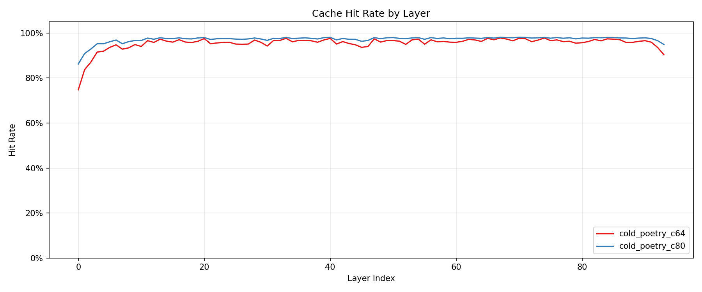

GLM-4.6-4bit:
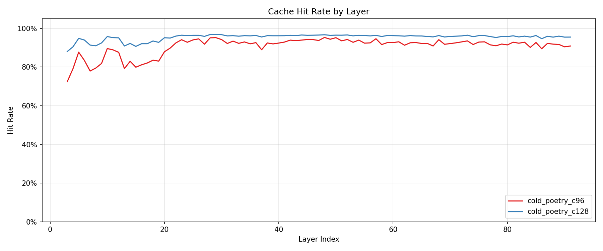

We see lower hit rates for first layers, which have higher diversity.

#### Warm start: hitrate by token

Warm start with cache prefilled based on access log **for the same prompt**. The warmup process picks top N experts for each layer, orders them according to that frequency, but cache eviction policy during runtime is just LRU, frequency values are discarded.

Qwen3-235B-A22B-6bit:
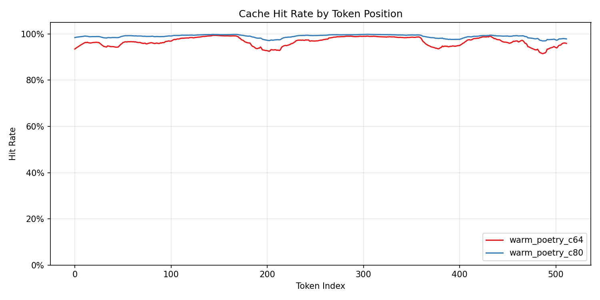

GLM-4.6-4bit:
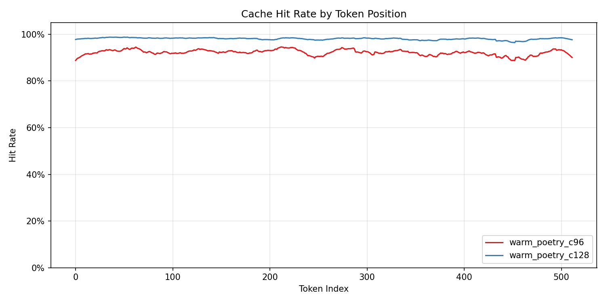

#### Warm start: hitrate by layer

Qwen3-235B-A22B-6bit:
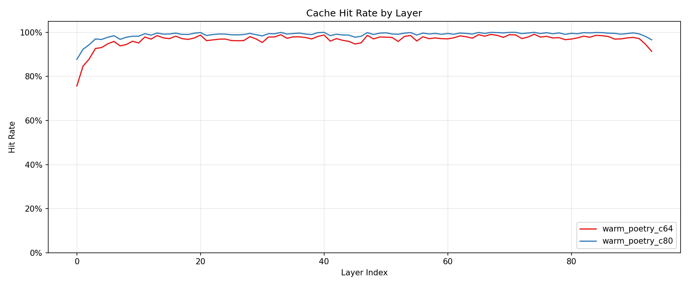

GLM-4.6-4bit:
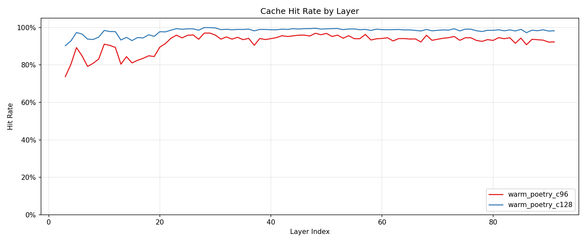

Minimax-M2-6bit:
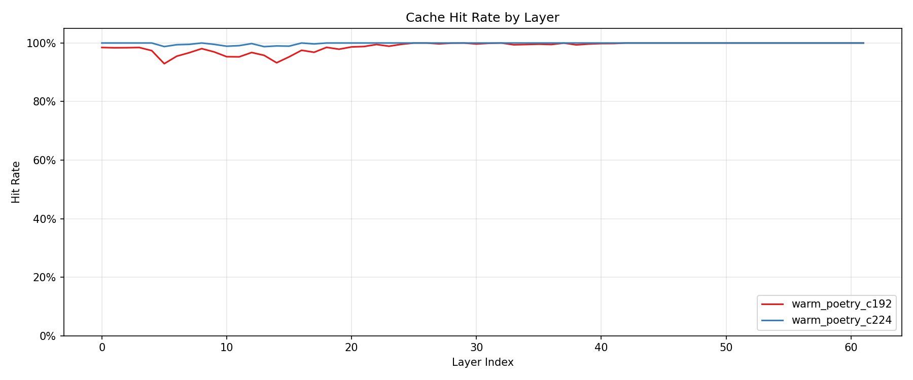

Same as with cold cache, much lower hit rates for first layers, which has higher diversity.

#### Prompt differences/expert overlap

Qwen3-235B-A22B-6bit:
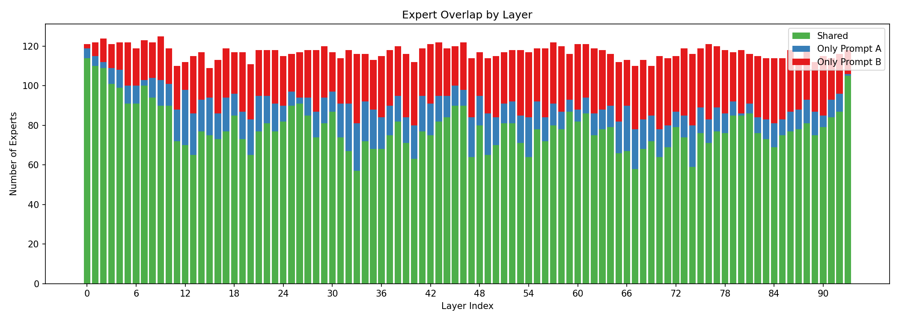

GLM-4.6-4bit:
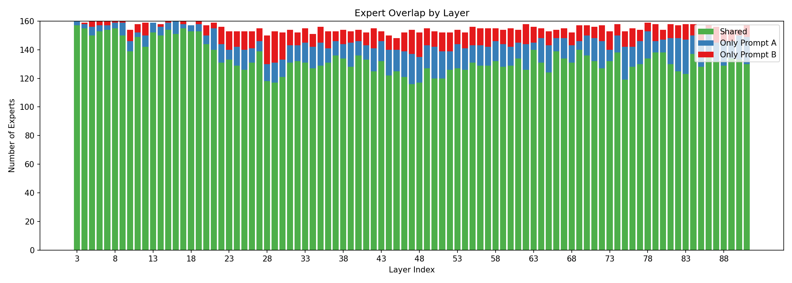

Minimax-M2-6bit:
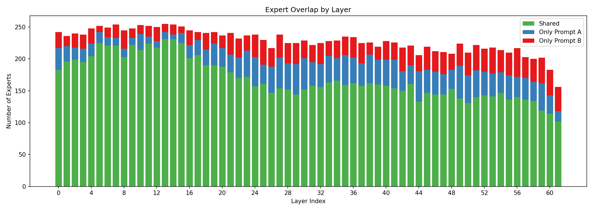

We can see that for first layers almost all experts are needed for both prompts, and for the rest, we have a large shared portion, smaller set of experts exclusive to each prompt and a small subset unused entirely.

Thus, we can expect that we can reuse quite some information from one prompt to another, but static allocation is going to be suboptimal. We can also see the difference between models - Qwen is having more disjoint expert sets.

#### Cross-prompt cache warmup

Here we measure overall cache hit rate as a function of initial warmup strategy:
* empty cache;
* cache initialized with random set of experts;
* cache initialized with usage data from same prompt;
* cache initialized with usage data from other prompt;
* cache initialized with usage from aggregated data.

Qwen3-235B-A22B-6bit:
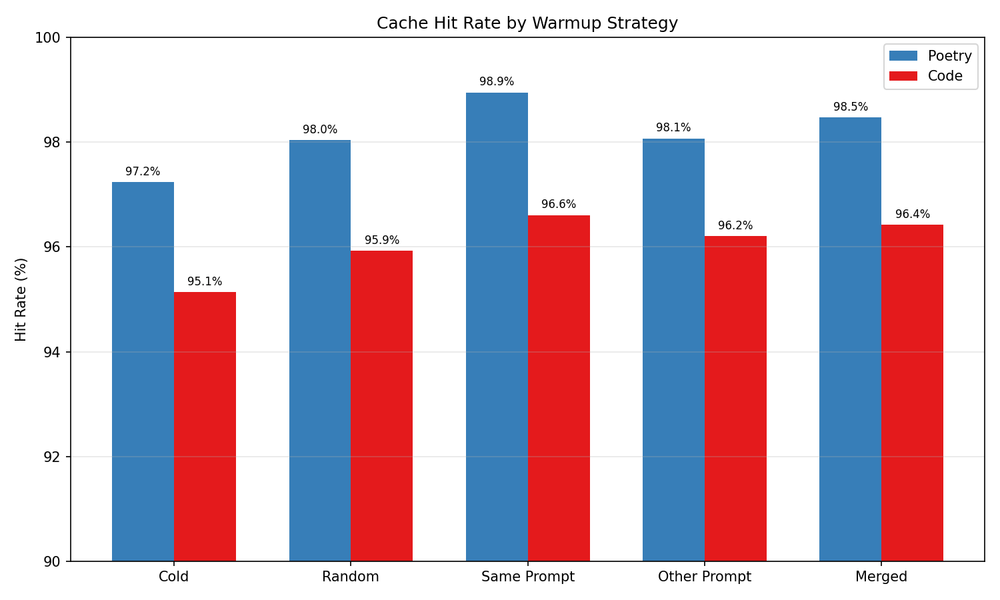

GLM-4.6-4bit:
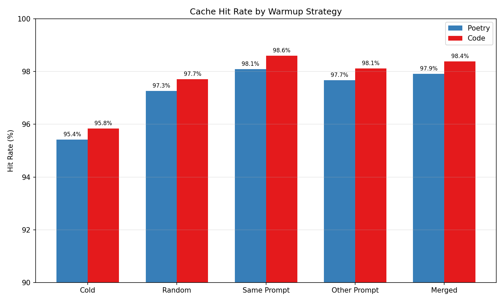

Minimax-M2-6bit:
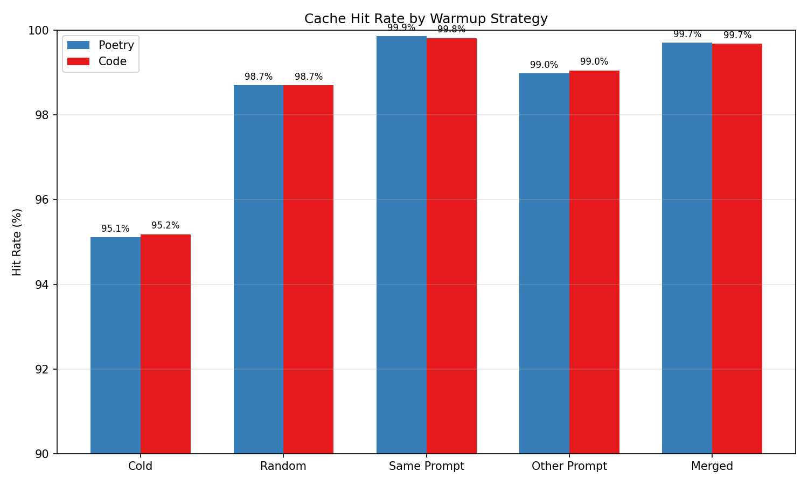


### tokens-per-second measurements

We focus on Qwen model here, as we can have a baseline which would fit on same hardware.

#### Baseline

Easily fitting in unified memory Qwen3-235B-A22B-4bit running on the same hardware:

Short prompt:
```
% mlx_lm.generate --model mlx-community/Qwen3-235B-A22B-4bit-DWQ -p "Write 5 poems about the ocean in different styles" -m 512
...
==========
Prompt: 18 tokens, 48.314 tokens-per-sec
Generation: 512 tokens, 28.679 tokens-per-sec
Peak memory: 132.397 GB
```

#### Cold/warm start

Cold start, generate 512 tokens from same prompt, 96 cache entries per layer (out of 128 experts).

```
% python scripts/generate.py -m ~/projects/llms/Qwen3-235B-A22B-Instruct-2507-6bit -c 96 -p "Write 5 poems about the ocean in different styles" -n 512
...
Generation: 512 tokens, 6.3 t/s
```

Warmup with random expert set:
```
% python scripts/generate.py -m ~/projects/llms/Qwen3-235B-A22B-Instruct-2507-6bit -c 96 -p "Write 5 poems about the ocean in different styles" -n 512 -R 42
...
Generation: 512 tokens, 9.0 t/s
```

Warmup with expert set from multiple previous generations:
```
% python scripts/generate.py -m ~/projects/llms/Qwen3-235B-A22B-Instruct-2507-6bit -c 96 -p "Write 5 poems about the ocean in different styles" -n 512 -W /tmp/qwen235-6b
...
Generation: 512 tokens, 10.4 t/s
```

### Fully-load layers

Our current allocation strategy is very simple - we have a cache of the same fixed size for every layer. This is clearly suboptimal, as different layers have difference access patterns - as we saw before, first layers access more experts.

A simple improvement we can do without making allocation dynamic (in the sense of size of cache per laeyr) is to just keep some of the layers fully loaded, not patch them with cache at all. This way we allocate that capacity where it's needed more without overcomplicating the allocation logic:

```
% python scripts/generate.py -m ~/projects/llms/Qwen3-235B-A22B-Instruct-2507-6bit -c 96 -p "Write 5 poems about the ocean in different styles" -n 512 -W /tmp/qwen235-6b -f 0-40,90-93

...
Generation: 512 tokens, 14.6 t/s
```

Better tradeoff is possible, as we can further tune cache size vs fully-loaded layers.

Another obvious inefficiency: we can first load layers in chunks to do prompt processing, and only then load cached layers - currently we'll have expert duplication for a single layer during prompt processing - so, for 80-100 layer models - ~1% memory overhead.

### Comparison between fully-loaded layers and large cache sizes

To understand the implementation overhead, we can also simulate the fully loaded layers with allocating larger cache size (== n_experts) for them. In this case, we'll still go through cache processing logic, but will never have to load/evict experts after initial warmup.

```
% python scripts/generate.py -m ~/projects/llms/Qwen3-235B-A22B-Instruct-2507-6bit -c 96 -p "Write 5 poems about the ocean in different styles" -n 512 -W /tmp/qwen235-6b --cache-size-override 0-40,90-93 128
...
Generation: 512 tokens, 10.9 t/s
```

As we can see, it is considerably slower, likely due to the fact that we do eager mx.eval() to get the expert ids, even if all of them are cached. This is one of the next steps to optimize.


### Longer prompt

Baseline 4 bit:
```
cat data/explain_cache_py.txt | mlx_lm.generate --model mlx-community/Qwen3-235B-A22B-4bit-DWQ -m 512 -p -
...
Prompt: 4374 tokens, 176.374 tokens-per-sec
Generation: 512 tokens, 23.976 tokens-per-sec
```

Cached 6 bit version:
```
python scripts/generate.py -m ~/projects/llms/Qwen3-235B-A22B-Instruct-2507-6bit -c 80 -P data/explain_cache_py.txt -n 512 -W /tmp/qwen235-6b -f 0-46,80-93
...
Prompt: 4374 tokens, 118.0 t/s
Generation: 512 tokens, 12.6 t/s
```

### Speculative Decoding Statistics Tool

The `scripts/speculative_stats.py` script provides detailed statistics for speculative decoding with mlx_lm. This is useful for analyzing draft model performance and tuning speculative decoding parameters.

Usage:
```
python scripts/speculative_stats.py \
    --model ./path/to/main-model \
    --draft-model ./path/to/draft-model \
    -p "Your prompt" \
    --max-tokens 512 \
    --num-draft-tokens 4
```

The tool provides:
- Live statistics during generation (acceptance rate, rolling averages)
- Overall accept rate and per-step statistics
- Distribution of accepted tokens per verification step
- Accept rate evolution (comparing first vs last 20% of generation)

This helps evaluate how well a draft model matches a target model, which is relevant for the speculative prefetch optimization discussed below.

### Conclusion

Even with current substantially suboptimal implementation (and hardware selection), we can run models which would not fit into fast unified memory at reasonable tps.

There are several opportunities to improve it:
* Optimize cached module access. As we can see from the experiment on fully loaded layers vs large cache size, there's an overhead for just being part of cache. It is likely happening becuase of eager mx.eval() calls.
* Speculative prefetch. At the moment, we load the experts synchronously, once we know the router output. However, we can make an educated guess of what we might need to prefetch a few layers in advance. As each layer is 'refining' the vector in embedding space, we can pass activation of layer L to router of layer (L + dL) and conditionally prefetch. One variation of such approach is described in [Accurate Expert Predictions in MoE Inference via Cross-Layer Gate](https://arxiv.org/abs/2502.12224v1)
* Better allocation/eviction policy for a given model/prompt types;
* Better prompt processing logic.

Faster secondary storage, like RAM <-> PCIe <-> VRAM will obviously help too, as reading from SSD is significantly slower. It would be interesting to test this approach on something like dual RTX 6000 PRO or 4-8 Tenstorrent cards

That said, the use case is likely limited to:
* Models which are 'almost fitting, but not quite';
* Personal use-cases, where aggregated throughput for multiple queries matters less.
